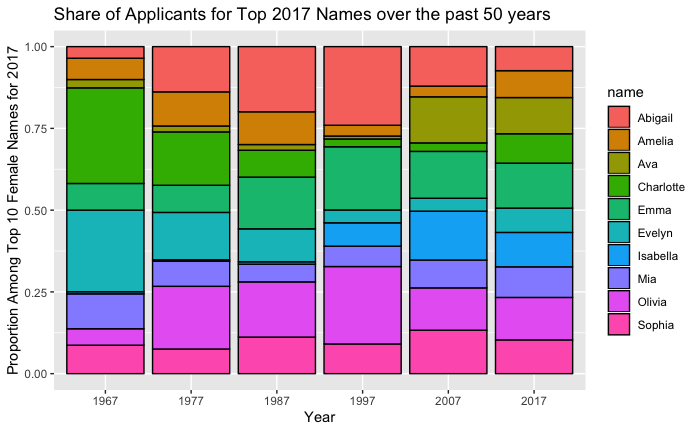

# Math 265: Homework 2
Your Name
2024-01-25

- [Question 1](#question-1)
- [Question 2](#question-2)
- [Question 3](#question-3)
- [Question 4](#question-4)
- [Question 5](#question-5)

**Important:** Use this document as a template for writing up your
assignment. For multi-part questions, write your code as R chunks
immediately below the corresponding part of the question. For this
assignment, empty chunks have been provided.

# Question 1

1.  **Regression to the Mean**

The phenomenon known as “regression to the mean” was first identified by
Sir Francis Galton in the late 19th century. The `Galton` data set from
the `mosaicData` package contains Galton’s famous data. Use the
`?Galton` command to get help about the data set after you have run the
chunk below to load the package `mosaicData`.

Create a single scatterplot of each person’s `height` (y) against their
father’s height (x) with the following characteristics:

- Separate your plot into facets by `sex` assigned at birth.

- Add a linear best fit line to all of your facets, turning off the
  standard error shading.

- As an alternative to `geom_point()`, consider `geom_jitter()`. Can you
  see my it might be preferred here? We’ll learn more about this
  function as we get further into visualiation.

- Make the points only half their normal size.

- Add a descriptive title to your plot and labels for the axes.

**Answer:**

``` r
library(mosaicData)
glimpse(Galton)
```

    Rows: 898
    Columns: 6
    $ family <fct> 1, 1, 1, 1, 2, 2, 2, 2, 3, 3, 4, 4, 4, 4, 4, 5, 5, 5, 5, 5, 5, …
    $ father <dbl> 78.5, 78.5, 78.5, 78.5, 75.5, 75.5, 75.5, 75.5, 75.0, 75.0, 75.…
    $ mother <dbl> 67.0, 67.0, 67.0, 67.0, 66.5, 66.5, 66.5, 66.5, 64.0, 64.0, 64.…
    $ sex    <fct> M, F, F, F, M, M, F, F, M, F, M, M, F, F, F, M, M, M, F, F, F, …
    $ height <dbl> 73.2, 69.2, 69.0, 69.0, 73.5, 72.5, 65.5, 65.5, 71.0, 68.0, 70.…
    $ nkids  <int> 4, 4, 4, 4, 4, 4, 4, 4, 2, 2, 5, 5, 5, 5, 5, 6, 6, 6, 6, 6, 6, …

``` r
# solution goes here
```

# Question 2

2.  **Baby Name Trends**

The R library `babynames` provides information on the historical
incidence of baby names in the U.S. since 1880 as provided by the Social
Security Administration. Load the `babynames` library and study the help
information (hint: use `?babynames`). This question will require both
data transformation and plotting skills. (Note: `babynames` has almost 2
million observations so don’t print it!) Issues of interest here are
whether popular names have changed over time and whether unisex and
gender-neutral names are more common in recent years.

Complete the following. (**Hint**: You may need to review cheat sheets
or other resources to find the commands you’ll need here. )

1.  Identify the top 10 names given to males in 2017 and the top 10
    names given to females in 2017. (By “male” and “female” here and
    throughout, we refer to sex assigned at birth.)

**Answer:**

``` r
library(babynames)
glimpse(babynames)
```

    Rows: 1,924,665
    Columns: 5
    $ year <dbl> 1880, 1880, 1880, 1880, 1880, 1880, 1880, 1880, 1880, 1880, 1880,…
    $ sex  <chr> "F", "F", "F", "F", "F", "F", "F", "F", "F", "F", "F", "F", "F", …
    $ name <chr> "Mary", "Anna", "Emma", "Elizabeth", "Minnie", "Margaret", "Ida",…
    $ n    <int> 7065, 2604, 2003, 1939, 1746, 1578, 1472, 1414, 1320, 1288, 1258,…
    $ prop <dbl> 0.07238359, 0.02667896, 0.02052149, 0.01986579, 0.01788843, 0.016…

``` r
# solution goes here
```

2.  Using **`ggplot()`**, generate two plots with the following. As
    always, put a title on each plot:

- Plot 1: A line plot of the reported proportion of babies born with
  each of the top 10 female names. Your plot should start with the year
  1900 and should have different colors for each name.

- Plot 2: A line plot of the reported proportion of babies born with
  each of the top 10 male names. Your plot should start with the year
  1900 and should have different colors for each name.

Hint: Look at `?geom_line()` for a useful function here.

**Answer:**

3.  Now introduce faceting by name so that you have 2 sets of 10 plots,
    one for each name.

**Answer:**

4.  Write a few observations including identifying the names that were
    popular in the past as well as those that are newly popular.

**Answer:**

# Question 3

3.  **Baby Name Trends (cont’d)**

Use the **babynames** data to create two versions of the chart shown in
the figure below: one as shown for Females and another for Males. Be
sure to also write a couple sentences commenting on what can be seen
about name trends from these two plots. (Hint: (1) This is an important
chance to learn about the difference between `year` and `factor(year)`;
(2) This is a good chance to either learn about the `weight` aesthetic
of `geom_bar()`.)

 **Answer:**

``` r
library(babynames)
# solution goes here
```

# Question 4

4.  **Fuel Economy Data**

According to the help pages, the vehicles data in the **fueleconomy**
package contains “fuel economy data from the EPA, 1985-2015. This
dataset contains selected variables, and removes vehicles with
incomplete data (e.g. no drive train data).”

The `cardata` tibble created in the chunk below restricts this dataset
to more common vehicles that were made in at least 10 years. To find out
more about the variables in this dataset, use `?vehicles` and/or
`?common`.

``` r
library(fueleconomy)
cardata <- left_join(common, vehicles)
glimpse(cardata)
```

    Rows: 14,531
    Columns: 14
    $ make  <chr> "Acura", "Acura", "Acura", "Acura", "Acura", "Acura", "Acura", "…
    $ model <chr> "Integra", "Integra", "Integra", "Integra", "Integra", "Integra"…
    $ n     <int> 42, 42, 42, 42, 42, 42, 42, 42, 42, 42, 42, 42, 42, 42, 42, 42, …
    $ years <int> 16, 16, 16, 16, 16, 16, 16, 16, 16, 16, 16, 16, 16, 16, 16, 16, …
    $ id    <dbl> 1833, 1834, 3037, 3038, 4183, 4184, 5303, 5304, 6442, 6443, 7519…
    $ year  <dbl> 1986, 1986, 1987, 1987, 1988, 1988, 1989, 1989, 1990, 1990, 1991…
    $ class <chr> "Subcompact Cars", "Subcompact Cars", "Subcompact Cars", "Subcom…
    $ trans <chr> "Automatic 4-spd", "Manual 5-spd", "Automatic 4-spd", "Manual 5-…
    $ drive <chr> "Front-Wheel Drive", "Front-Wheel Drive", "Front-Wheel Drive", "…
    $ cyl   <dbl> 4, 4, 4, 4, 4, 4, 4, 4, 4, 4, 4, 4, 4, 4, 4, 4, 4, 4, 4, 4, 4, 4…
    $ displ <dbl> 1.6, 1.6, 1.6, 1.6, 1.6, 1.6, 1.6, 1.6, 1.8, 1.8, 1.8, 1.8, 1.7,…
    $ fuel  <chr> "Regular", "Regular", "Regular", "Regular", "Regular", "Regular"…
    $ hwy   <dbl> 28, 28, 28, 28, 27, 28, 27, 28, 24, 26, 26, 26, 26, 26, 28, 26, …
    $ cty   <dbl> 22, 23, 22, 23, 22, 23, 22, 23, 20, 21, 21, 21, 21, 21, 22, 21, …

Use separate `filter()` commands to find all vehicles in `cardata` that:

1.  Get between 40 and 50 mpg (inclusive) on the highway.

**Answer:**

2.  Are made by either Chevrolet or Ford and were made after the year
    2000.

**Answer:**

3.  Were made in a year that is a multiple of 5 (don’t list all such
    years) and have Manual transmission. (Hint: This is a great
    opportunity to learn about the `str_detect()` function that is part
    of the Tidyverse. Do NOT use a version of the `grep` command that
    you might come across if you do a web search.)

**Answer:**

4.  Had lower highway mileage than city mileage. Do these vehicles have
    anything else in common?

**Answer:**

5.  Were missing data for drivetrain.

**Answer:**

# Question 5

5.  **National Health and Nutrition Examination Data (NHANES)**

The US National Center for Health Statistics (NCHS) has conducted a
series of health and nutrition surveys since the early 1960’s. Since
1999 approximately 5,000 individuals of all ages are interviewed in
their homes every year and complete the health examination component of
the survey. Data from two survey years is contained in the `NHANES` data
set provided with the **NHANES** package.

**Note: The \*\*NHANES\* library provides two data sets: `NHANES` and
`NHANESraw`. Be sure to use just the `NHANESraw` data set for this
problem.**

Use the `NHANESraw` data set to carry out the following separately. The
following chunk loads the data and provides an initial look at the
variables.

``` r
library(NHANES)
glimpse(NHANES)
```

    Rows: 10,000
    Columns: 76
    $ ID               <int> 51624, 51624, 51624, 51625, 51630, 51638, 51646, 5164…
    $ SurveyYr         <fct> 2009_10, 2009_10, 2009_10, 2009_10, 2009_10, 2009_10,…
    $ Gender           <fct> male, male, male, male, female, male, male, female, f…
    $ Age              <int> 34, 34, 34, 4, 49, 9, 8, 45, 45, 45, 66, 58, 54, 10, …
    $ AgeDecade        <fct>  30-39,  30-39,  30-39,  0-9,  40-49,  0-9,  0-9,  40…
    $ AgeMonths        <int> 409, 409, 409, 49, 596, 115, 101, 541, 541, 541, 795,…
    $ Race1            <fct> White, White, White, Other, White, White, White, Whit…
    $ Race3            <fct> NA, NA, NA, NA, NA, NA, NA, NA, NA, NA, NA, NA, NA, N…
    $ Education        <fct> High School, High School, High School, NA, Some Colle…
    $ MaritalStatus    <fct> Married, Married, Married, NA, LivePartner, NA, NA, M…
    $ HHIncome         <fct> 25000-34999, 25000-34999, 25000-34999, 20000-24999, 3…
    $ HHIncomeMid      <int> 30000, 30000, 30000, 22500, 40000, 87500, 60000, 8750…
    $ Poverty          <dbl> 1.36, 1.36, 1.36, 1.07, 1.91, 1.84, 2.33, 5.00, 5.00,…
    $ HomeRooms        <int> 6, 6, 6, 9, 5, 6, 7, 6, 6, 6, 5, 10, 6, 10, 10, 4, 3,…
    $ HomeOwn          <fct> Own, Own, Own, Own, Rent, Rent, Own, Own, Own, Own, O…
    $ Work             <fct> NotWorking, NotWorking, NotWorking, NA, NotWorking, N…
    $ Weight           <dbl> 87.4, 87.4, 87.4, 17.0, 86.7, 29.8, 35.2, 75.7, 75.7,…
    $ Length           <dbl> NA, NA, NA, NA, NA, NA, NA, NA, NA, NA, NA, NA, NA, N…
    $ HeadCirc         <dbl> NA, NA, NA, NA, NA, NA, NA, NA, NA, NA, NA, NA, NA, N…
    $ Height           <dbl> 164.7, 164.7, 164.7, 105.4, 168.4, 133.1, 130.6, 166.…
    $ BMI              <dbl> 32.22, 32.22, 32.22, 15.30, 30.57, 16.82, 20.64, 27.2…
    $ BMICatUnder20yrs <fct> NA, NA, NA, NA, NA, NA, NA, NA, NA, NA, NA, NA, NA, N…
    $ BMI_WHO          <fct> 30.0_plus, 30.0_plus, 30.0_plus, 12.0_18.5, 30.0_plus…
    $ Pulse            <int> 70, 70, 70, NA, 86, 82, 72, 62, 62, 62, 60, 62, 76, 8…
    $ BPSysAve         <int> 113, 113, 113, NA, 112, 86, 107, 118, 118, 118, 111, …
    $ BPDiaAve         <int> 85, 85, 85, NA, 75, 47, 37, 64, 64, 64, 63, 74, 85, 6…
    $ BPSys1           <int> 114, 114, 114, NA, 118, 84, 114, 106, 106, 106, 124, …
    $ BPDia1           <int> 88, 88, 88, NA, 82, 50, 46, 62, 62, 62, 64, 76, 86, 6…
    $ BPSys2           <int> 114, 114, 114, NA, 108, 84, 108, 118, 118, 118, 108, …
    $ BPDia2           <int> 88, 88, 88, NA, 74, 50, 36, 68, 68, 68, 62, 72, 88, 6…
    $ BPSys3           <int> 112, 112, 112, NA, 116, 88, 106, 118, 118, 118, 114, …
    $ BPDia3           <int> 82, 82, 82, NA, 76, 44, 38, 60, 60, 60, 64, 76, 82, 7…
    $ Testosterone     <dbl> NA, NA, NA, NA, NA, NA, NA, NA, NA, NA, NA, NA, NA, N…
    $ DirectChol       <dbl> 1.29, 1.29, 1.29, NA, 1.16, 1.34, 1.55, 2.12, 2.12, 2…
    $ TotChol          <dbl> 3.49, 3.49, 3.49, NA, 6.70, 4.86, 4.09, 5.82, 5.82, 5…
    $ UrineVol1        <int> 352, 352, 352, NA, 77, 123, 238, 106, 106, 106, 113, …
    $ UrineFlow1       <dbl> NA, NA, NA, NA, 0.094, 1.538, 1.322, 1.116, 1.116, 1.…
    $ UrineVol2        <int> NA, NA, NA, NA, NA, NA, NA, NA, NA, NA, NA, NA, NA, N…
    $ UrineFlow2       <dbl> NA, NA, NA, NA, NA, NA, NA, NA, NA, NA, NA, NA, NA, N…
    $ Diabetes         <fct> No, No, No, No, No, No, No, No, No, No, No, No, No, N…
    $ DiabetesAge      <int> NA, NA, NA, NA, NA, NA, NA, NA, NA, NA, NA, NA, NA, N…
    $ HealthGen        <fct> Good, Good, Good, NA, Good, NA, NA, Vgood, Vgood, Vgo…
    $ DaysPhysHlthBad  <int> 0, 0, 0, NA, 0, NA, NA, 0, 0, 0, 10, 0, 4, NA, NA, 0,…
    $ DaysMentHlthBad  <int> 15, 15, 15, NA, 10, NA, NA, 3, 3, 3, 0, 0, 0, NA, NA,…
    $ LittleInterest   <fct> Most, Most, Most, NA, Several, NA, NA, None, None, No…
    $ Depressed        <fct> Several, Several, Several, NA, Several, NA, NA, None,…
    $ nPregnancies     <int> NA, NA, NA, NA, 2, NA, NA, 1, 1, 1, NA, NA, NA, NA, N…
    $ nBabies          <int> NA, NA, NA, NA, 2, NA, NA, NA, NA, NA, NA, NA, NA, NA…
    $ Age1stBaby       <int> NA, NA, NA, NA, 27, NA, NA, NA, NA, NA, NA, NA, NA, N…
    $ SleepHrsNight    <int> 4, 4, 4, NA, 8, NA, NA, 8, 8, 8, 7, 5, 4, NA, 5, 7, N…
    $ SleepTrouble     <fct> Yes, Yes, Yes, NA, Yes, NA, NA, No, No, No, No, No, Y…
    $ PhysActive       <fct> No, No, No, NA, No, NA, NA, Yes, Yes, Yes, Yes, Yes, …
    $ PhysActiveDays   <int> NA, NA, NA, NA, NA, NA, NA, 5, 5, 5, 7, 5, 1, NA, 2, …
    $ TVHrsDay         <fct> NA, NA, NA, NA, NA, NA, NA, NA, NA, NA, NA, NA, NA, N…
    $ CompHrsDay       <fct> NA, NA, NA, NA, NA, NA, NA, NA, NA, NA, NA, NA, NA, N…
    $ TVHrsDayChild    <int> NA, NA, NA, 4, NA, 5, 1, NA, NA, NA, NA, NA, NA, 4, N…
    $ CompHrsDayChild  <int> NA, NA, NA, 1, NA, 0, 6, NA, NA, NA, NA, NA, NA, 3, N…
    $ Alcohol12PlusYr  <fct> Yes, Yes, Yes, NA, Yes, NA, NA, Yes, Yes, Yes, Yes, Y…
    $ AlcoholDay       <int> NA, NA, NA, NA, 2, NA, NA, 3, 3, 3, 1, 2, 6, NA, NA, …
    $ AlcoholYear      <int> 0, 0, 0, NA, 20, NA, NA, 52, 52, 52, 100, 104, 364, N…
    $ SmokeNow         <fct> No, No, No, NA, Yes, NA, NA, NA, NA, NA, No, NA, NA, …
    $ Smoke100         <fct> Yes, Yes, Yes, NA, Yes, NA, NA, No, No, No, Yes, No, …
    $ Smoke100n        <fct> Smoker, Smoker, Smoker, NA, Smoker, NA, NA, Non-Smoke…
    $ SmokeAge         <int> 18, 18, 18, NA, 38, NA, NA, NA, NA, NA, 13, NA, NA, N…
    $ Marijuana        <fct> Yes, Yes, Yes, NA, Yes, NA, NA, Yes, Yes, Yes, NA, Ye…
    $ AgeFirstMarij    <int> 17, 17, 17, NA, 18, NA, NA, 13, 13, 13, NA, 19, 15, N…
    $ RegularMarij     <fct> No, No, No, NA, No, NA, NA, No, No, No, NA, Yes, Yes,…
    $ AgeRegMarij      <int> NA, NA, NA, NA, NA, NA, NA, NA, NA, NA, NA, 20, 15, N…
    $ HardDrugs        <fct> Yes, Yes, Yes, NA, Yes, NA, NA, No, No, No, No, Yes, …
    $ SexEver          <fct> Yes, Yes, Yes, NA, Yes, NA, NA, Yes, Yes, Yes, Yes, Y…
    $ SexAge           <int> 16, 16, 16, NA, 12, NA, NA, 13, 13, 13, 17, 22, 12, N…
    $ SexNumPartnLife  <int> 8, 8, 8, NA, 10, NA, NA, 20, 20, 20, 15, 7, 100, NA, …
    $ SexNumPartYear   <int> 1, 1, 1, NA, 1, NA, NA, 0, 0, 0, NA, 1, 1, NA, NA, 1,…
    $ SameSex          <fct> No, No, No, NA, Yes, NA, NA, Yes, Yes, Yes, No, No, N…
    $ SexOrientation   <fct> Heterosexual, Heterosexual, Heterosexual, NA, Heteros…
    $ PregnantNow      <fct> NA, NA, NA, NA, NA, NA, NA, NA, NA, NA, NA, NA, NA, N…

1.  Use `select()` to reorganize the columns as follows: the first 5
    variables, followed by all the blood pressure measurements, and then
    all the other variables.

**Answer:**

2.  Create three new variables: ratio of systolic to diastolic blood
    pressure (using the average BP measures), height in inches and
    weight in pounds.

**Answer:**

3.  Use the `select()` helper functions to select only variables dealing
    with alcohol or marijuana.

**Answer:**

4.  Use the `select()` helper functions to select only variables
    containing `Sex` or `Gender` in the name.

**Answer:**

5.  Include only the cases in the most recent survey year and sort them
    in descending order by height in inches. How tall were the tallest
    three individuals?

**Answer:**
